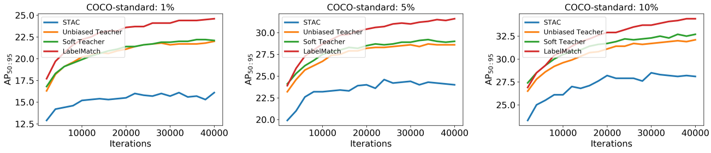

# Performance

## SSOD

### Fair Comparison

For fair comparison, we reproduce some SSOD methods with the same setting (e.g., augmentation, training iterations, batch-size, and so on.).

- Soft-Teacher: without box-jitter (we will add box-jitter in next version)
- PASCAL-VOC: use 2-GPU

#### COCO-standard

| method                         | batch-size                | iterations | 1%   | 5%   | 10%  |
| ------------------------------ | ------------------------- | ---------- | ---- | ---- | ---- |
| STAC (thr=0.9, CE)             | 32 labeled + 32 unlabeled | 40K        | 16.1 | 24.0 | 28.1 |
| Unbiased-Teacher (thr=0.7, FL) | 32 labeled + 32 unlabeled | 40K        | 22.0 | 28.6 | 32.1 |
| Soft-Teacher (thr=0.9, CE)     | 32 labeled + 32 unlabeled | 40K        | 22.1 | 29.0 | 32.7 |
| LabelMatch (original code)     | 32 labeled + 32 unlabeled | 40K        | 24.6 | 31.5 | 34.6 |
| LabelMatch (here)              | 32 labeled + 32 unlabeled | 40K        | 24.6 | 31.6 | 34.4 |

> NOTE: we use the **ablation training setting** here. (different training setting can be found in supplementary materials.)

#### PASCAL-VOC

| method                         | batch-size             | iterations | AP50:95 | AP50 |
| ------------------------------ | ---------------------- | ---------- | ------- | ---- |
| STAC (thr=0.9, CE)             | 8 labeled +8 unlabeled | 80K        | 46.5    | 78.6 |
| Unbiased-Teacher (thr=0.7, FL) | 8 labeled +8 unlabeled | 80K        | 53.3    | 84.2 |
| Soft-Teacher (thr=0.9, CE)     | 8 labeled +8 unlabeled | 80K        | 52.8    | 84.3 |
| LabelMatch                     | 8 labeled +8 unlabeled | 80K        | 54.7    | 84.8 |

